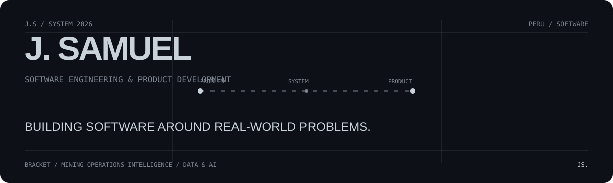

<p align="center"></p>

<div align="center">

**I design and build software products around real-world problems.**

Based in Peru · Product Engineering · Full Stack · Software Architecture · Data & AI

[**LIVE PORTFOLIO ↗**](https://j-samuel-portfolio-93bhouqpa-xutiann.vercel.app) · [**PORTFOLIO SOURCE**](https://github.com/SamuelShiw/MiWebPersonal) · [LinkedIn](https://www.linkedin.com/in/j-samuell/) · [Email](mailto:sumailqm10@gmail.com) · [WhatsApp](https://wa.me/51901036216)

</div>

---

### 01 / SELECTED SYSTEMS

<table>
<tr>
<td width="50%" valign="top">

#### BRACKET
**Dental Clinic Management System**

A software platform designed to centralize clinical and administrative workflows for a dental clinic.

`Healthcare` · `Product Engineering` · `Full Stack`

**Engineering direction**  
React · TypeScript · Node.js · PostgreSQL · Prisma

</td>
<td width="50%" valign="top">

#### MINING OPERATIONS INTELLIGENCE
**Decision-Support Web Application**

Transforming operational spreadsheet data into structured information for analysis and decision-making.

`Mining` · `Data` · `Decision Support`

**System flow**  
Excel → Processing → Indicators → Information → Decision

</td>
</tr>
</table>

---

### 02 / SYSTEM LOGIC

```text
REAL PROBLEM
    ↓
UNDERSTAND THE WORKFLOW
    ↓
DESIGN THE SYSTEM
    ↓
BUILD THE PRODUCT
    ↓
VERIFY WITH EVIDENCE
    ↓
ITERATE
```

I care about understanding the problem before choosing the technology. My work is moving toward systems where product thinking, software architecture and implementation meet.

---

### 03 / FIELD → SOFTWARE

Before focusing on software development, I worked in mining operations as a drilling assistant.

That experience gave me direct context around field work, operational processes and the importance of turning information into useful decisions. Today, I bring that perspective into the software products I build.

> Field experience gives me context. Software engineering gives me a way to turn problems into systems.

---

### 04 / ENGINEERING FOCUS

| | |
|---|---|
| **Product Engineering** | Problem → workflow → system → product |
| **Full Stack Development** | Interfaces · APIs · business logic · data |
| **Software Architecture** | Domain models · modular systems · integrations |
| **Data & AI** | Analysis · visualization · ML · AI-assisted solutions |

---

### 05 / TOOLBOX

```text
LANGUAGES      TypeScript · JavaScript · Python · SQL
FRONTEND       React · Vite · Tailwind CSS
BACKEND        Node.js · Express
DATA           PostgreSQL · Prisma · Power BI
ENGINEERING    Git · GitHub · Docker
```

Tools change. The goal stays the same: **build useful systems.**

---

### 06 / OTHER WORK

**SIGET-ML**  
Machine Learning · FastAPI

**Road Accident Analysis / Puno**  
Data Analysis · Machine Learning

**Intelligent Surveillance**  
Computer Vision · YOLO · Experimental

---

### 07 / CURRENTLY

```text
STUDYING   Software Engineering with Artificial Intelligence
BUILDING   BRACKET · Mining Operations Intelligence
LEARNING   Software Architecture · Cloud · Data & AI
```

---

<div align="center">

### HAVE A PROBLEM WORTH SOLVING?

I'm open to software projects, collaborations and professional opportunities.

[**EMAIL**](mailto:sumailqm10@gmail.com) · [**LINKEDIN**](https://www.linkedin.com/in/j-samuell/) · [**WHATSAPP**](https://wa.me/51901036216)

<sub>J.S / 2026</sub>

</div>
